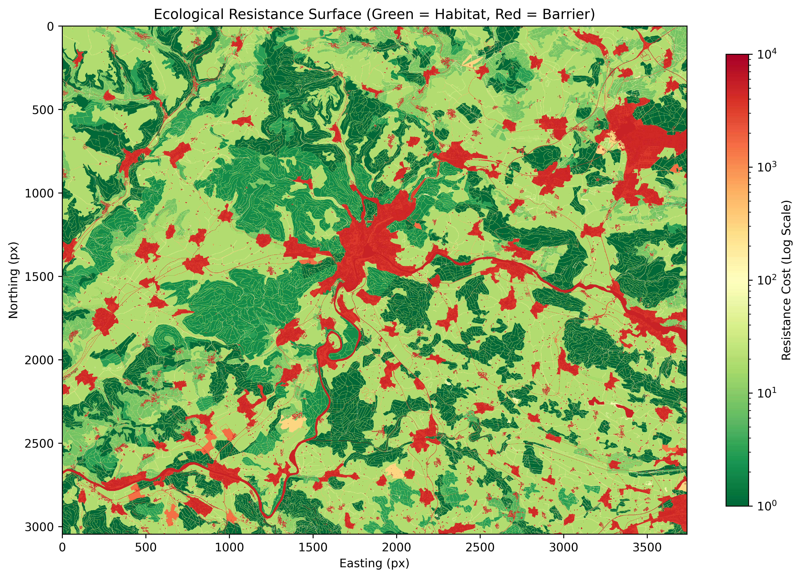
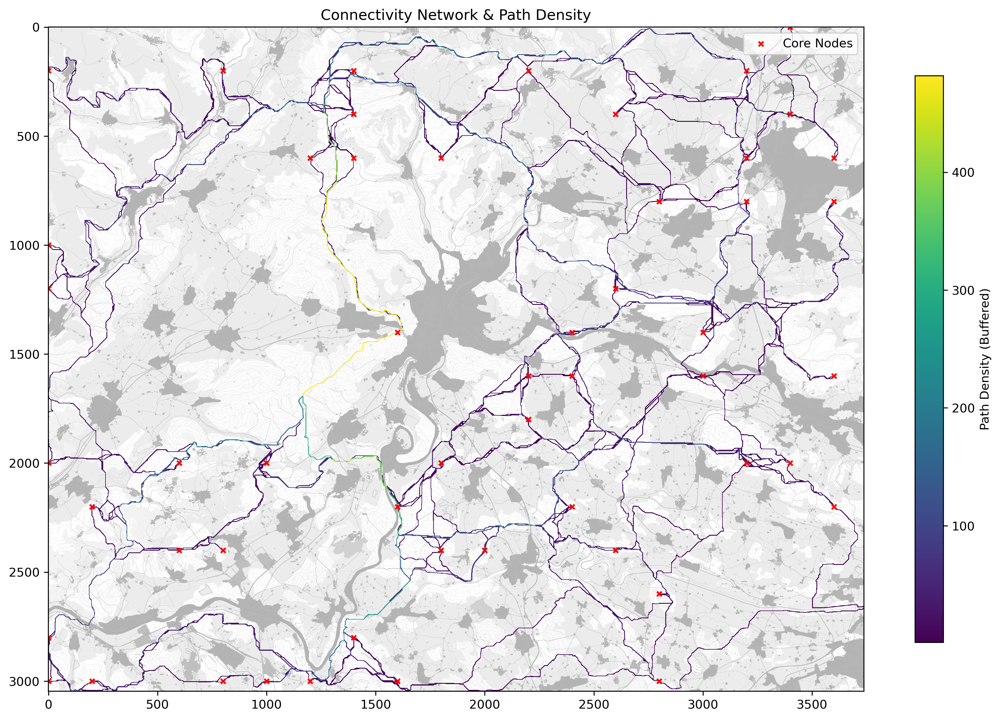
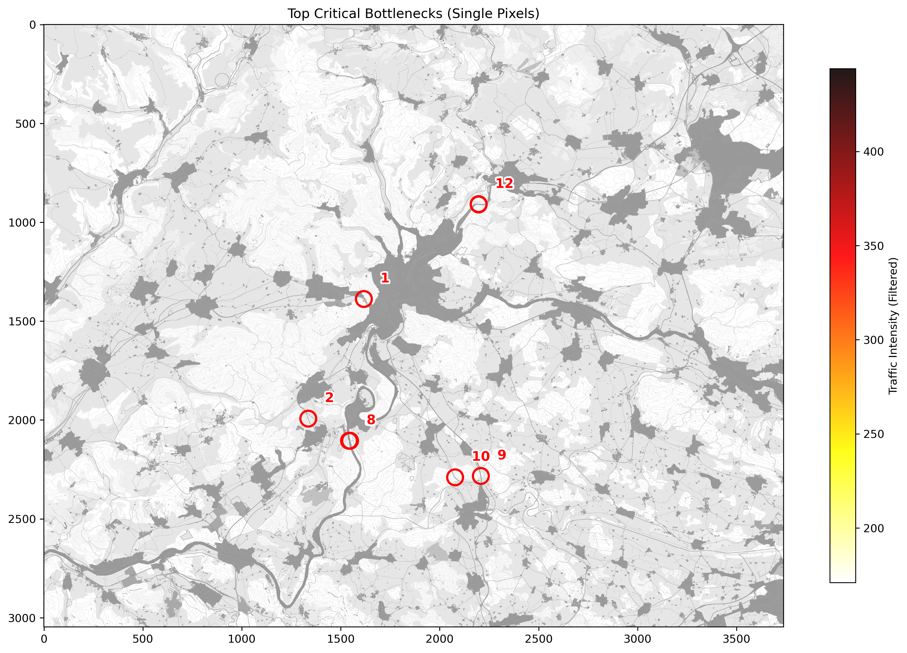
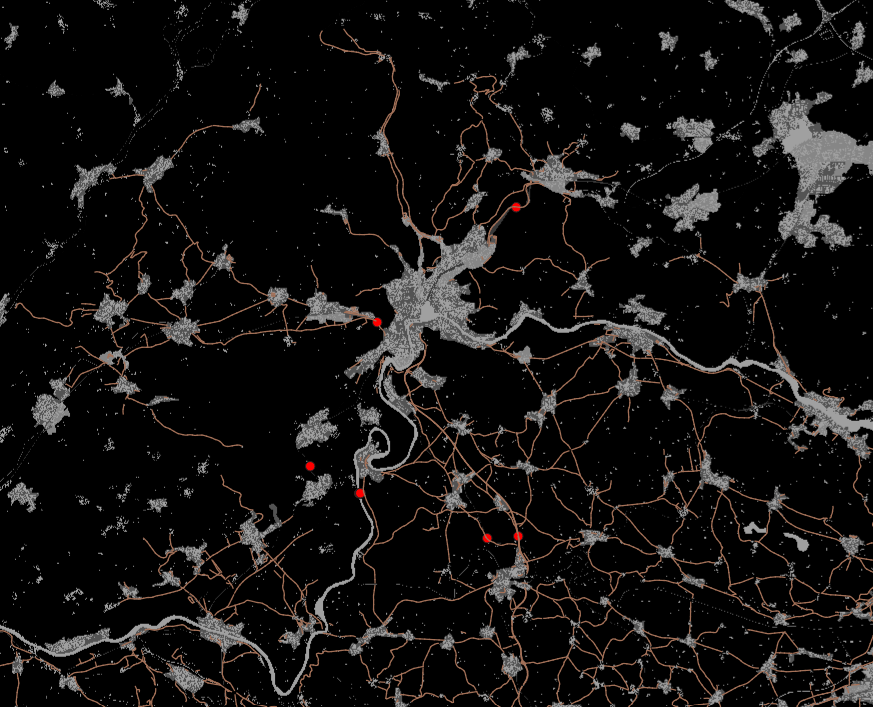
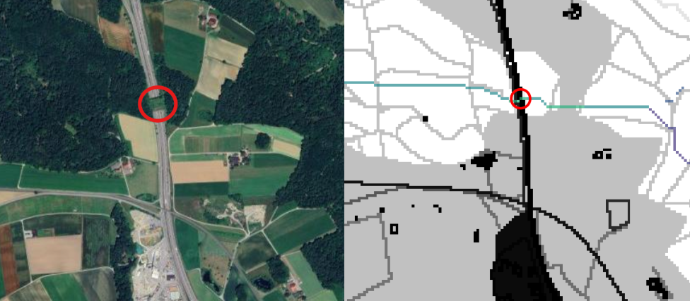

# Abstract {-}
Habitat fragmentation poses a critical threat to biodiversity in the Swiss Lowlands. This project investigates ecological connectivity for the Roe Deer (Capreolus capreolus) in the Canton of Schaffhausen, a region heavily dissected by transport infrastructure and urban settlements. The primary objective was to develop a reproducible, data-driven connectivity model to identify functional wildlife corridors and critical bottlenecks using open-source data.

A fully automated Python-based geospatial workflow was implemented to generate a high-resolution (10 m) resistance surface by integrating OpenStreetMap (OSM) and Corine Land Cover (CLC) data. Using a Least-Cost Path (LCP) analysis based on a "Barrier Dominance" principle, potential movement routes between core habitat patches were simulated across the transboundary study area.

The results reveal a highly fragmented landscape where wildlife movement is constrained to a specific dendritic topology. A key finding is the identification of a vital North-South corridor to the west of the Schaffhausen urban agglomeration, acting as the primary biological link between German habitats and the Swiss Plateau in this region. The model's validity was confirmed through a spatial cross-verification with independent traffic accident risk models and the successful independent identification of the existing Schneitenberg wildlife passage. The study concludes that regional connectivity relies on a few fragile bottlenecks. To ensure long-term population viability, spatial planning must prioritize the protection of the western corridor from further urban sprawl and implement targeted mitigation measures at identified conflict zones along the A4 motorway.

# Zusammenfassung {.unnumbered .unlisted}
Die Lebensraumfragmentierung stellt eine ernsthafte Bedrohung für die Biodiversität im Schweizer Mittelland dar. Diese Arbeit untersucht die ökologische Vernetzung für das Reh (Capreolus capreolus) im Kanton Schaffhausen, einer Region, die stark durch Verkehrsinfrastruktur und Siedlungsgebiete zerschnitten ist. Das primäre Ziel war die Entwicklung eines reproduzierbaren, datengestützten Konnektivitätsmodells zur Identifikation funktionaler Wildtierkorridore und kritischer Stellen unter Verwendung von Open-Source-Daten.

Ein vollautomatisierter Python-basierter Workflow wurde implementiert, um durch die Integration von OpenStreetMap (OSM) und Corine Land Cover (CLC) daten eine hochauflösende (10 m) Widerstandskarte zu erstellen. Mittels einer Least-Cost Path (LCP) Analyse, basierend auf dem Prinzip der "Barrieren-Dominanz", wurden potenzielle Wanderbewegungen zwischen Kernhabitaten im grenzüberschreitenden Untersuchungsgebiet simuliert.

Die Ergebnisse zeigen eine stark fragmentierte Landschaft, in der Bewegungen auf eine spezifische netzartige Topologie beschränkt sind. Ein zentrales Ergebnis ist die Identifikation eines vitalen Nord-Süd-Korridors westlich der Agglomeration Schaffhausen, der als primäre biologische Verbindung zwischen den deutschen Habitaten und dem Schweizer Mittelland in dieser region fungiert. Die Validität des Modells wurde durch einen räumlichen Abgleich mit unabhängigen Unfallrisikomodellen sowie durch die erfolgreiche, unabhängige Identifikation der bestehenden Wildtierüberführung Schneitenberg bestätigt. Die Studie schliesst, dass die regionale Vernetzung von wenigen, fragilen Engpässen abhängt. Um die langfristige Lebensfähigkeit der Population zu sichern, muss die Raumplanung den Schutz des westlichen Korridors vor weiterer Zersiedelung priorisieren und gezielte Entschärfungsmassnahmen an den identifizierten Konfliktzonen entlang der A4 umsetzen.

# Inhaltsverzeichnis {.unnumbered .unlisted}



:::


# Liste der Abkürzungen {.unnumbered}

+---------+----------------------------------+
| OSM     | Open Street Map                  |
+---------+----------------------------------+
| CLC     | Corine Landcover                 |
+---------+----------------------------------+
| LCP     | Least Cost Path                  |
+---------+----------------------------------+
| GIS     | Geographic Information Science   |
+---------+----------------------------------+
| aoi     | Area of Interest                 |
+---------+----------------------------------+  

# Introduction

## The Challenge of Habitat Fragmentation
Across Europe, landscapes are undergoing rapid transformation driven by the expansion of transportation infrastructure, urban sprawl, and the intensification of agriculture @europeanenvironmentagencyLandscapeFragmentationEurope2011. This process leads to habitat fragmentation: the division of large, continuous habitats into smaller, more isolated patches. Fragmentation is recognized as a primary driver of global biodiversity loss @haddadHabitatFragmentationIts2015. Its ecological consequences are severe: it limits wildlife mobility, isolates populations, and restricts gene flow @kuehnGeneticEffectTransportation2007. This, in turn, can lead to inbreeding, a loss of adaptive genetic diversity, and reduced long-term population resilience, making populations more vulnerable to local extinction @haddadHabitatFragmentationIts2015; @kuehnGeneticEffectTransportation2007.

The situation in Switzerland is particularly acute @jaeferDegreeLandscapeFragmentation2007. The Swiss Federal Office for the Environment (FOEN) has identified fragmentation from artificial barriers as a key pressure on biodiversity. This fragmentation is most severe in the Swiss Central Lowlands @europeanenvironmentagencyLandscapeFragmentationEurope2011. A comprehensive study by the Swiss Federal Institute for Forest, Snow and Landscape Research (WSL) identified the Canton of Schaffhausen as one of the eight most fragmented cantons in the country, underscoring the urgent need for regional connectivity planning @jaeferDegreeLandscapeFragmentation2007.

## The Role of Ecological Connectivity
To counteract these effects, conservation efforts increasingly focus on maintaining and restoring ecological connectivity, defined as the unimpeded movement of species and the flow of natural processes that sustain life. A primary tool for achieving this is the identification and protection of wildlife corridors. These are linear landscape elements that link otherwise isolated habitat patches. By facilitating animal movement, corridors are essential for enabling dispersal, maintaining genetic diversity, and allowing species to migrate in response to seasonal needs or long-term climate change @hiltyGuidelinesConservingConnectivity2020.

## Focal Species: The Roe Deer (Capreolus capreolus)
The successful planning of such corridors depends on a species-specific approach @beierUncertaintyAnalysisLeastcost2009. This project focuses on the roe deer (Capreolus capreolus), an ideal focal species for connectivity modelling in the Swiss landscape. As one of Europe's most common wild ungulates, the roe deer is highly adaptable. It demonstrates significant behavioral flexibility, inhabiting not only its traditional forest-mosaic habitats but also does well in open agricultural plains @jepsenModellingRoeDeer2004.

Despite this adaptability, roe deer are highly vulnerable to fragmentation. Transportation networks pose a dual threat: direct mortality from wildlife-vehicle collisions and the barrier effect, where high-traffic roads hinder access to critical resources @martzCrossingsCollisionsExploring2024. This barrier effect can be as damaging as direct habitat loss, leading to the genetic isolation of populations. A study on roe deer in Central Switzerland, for example, demonstrated significant genetic differentiation between populations separated by a fenced motorway. Because roe deer are widespread, mobile, and frequently interact with infrastructure, they serve as an excellent model for assessing landscape-level connectivity for large mammals @kuehnGeneticEffectTransportation2007.

## Methodology: Least-Cost Path (LCP) Analysis
This study employs Least-Cost Path (LCP) analysis, a standard and widely used methodology in GIS-based connectivity modelling @beierUncertaintyAnalysisLeastcost2009. The LCP approach is built on the concept of a resistance surface @cushmanBiologicalCorridorsConnectivity2013. This is a GIS raster layer where each pixel is assigned a "cost" value representing the difficulty, energy expenditure, or mortality risk a species encounters when moving through that specific landscape type @zellerEstimatingLandscapeResistance2012. This "cost" is derived from expert knowledge and ecological literature, assigning low resistance to preferred habitats and high resistance to barriers @beierUncertaintyAnalysisLeastcost2009. The LCP algorithm then calculates the most efficient route between defined core habitat patches, the path of least cumulative resistance @cushmanBiologicalCorridorsConnectivity2013.

## Project Objectives
The primary objective of this project is to develop, improve, and evaluate a GIS-based connectivity model for roe deer (Capreolus capreolus) in the highly fragmented landscape of the Canton of Schaffhausen, implemented using the Python programming language.

The specific aims are to:

- Create a detailed resistance surface using OpenStreetMap and Corine Land Cover data.

- Perform a Least-Cost Path (LCP) analysis to compute cumulative movement costs and identify potential wildlife corridors connecting suitable habitat patches.

- Analyze the resulting model to identify and map key bottlenecks, major obstacles, and other landscape patterns that limit ecological connectivity.

The final output will be a transparent, code-based connectivity model and a set of cartographic products. This work is intended to serve as a practical, data-driven decision-making aid for regional conservation and spatial planning.

# Theoretical Framework

## Ecological Connectivity and Wildlife Corridors
### Functional vs. Structural Connectivity
There are two distinct forms of Landscape connectivity: structural and functional. Structural connectivity refers only to the physical arrangement and contiguity of landscape elements, such as the spatial proximity of habitat patches, without regard for the specific mobility of an organism. In contrast, functional connectivity explicitly includes the behavioral response of a species to these landscape features and describes the degree to which the landscape actually facilitates or impedes movement @tischendorfUsageMeasurementLandscape2000.

Although structural connectivity can be measured using landscape metrics alone, this often fails to predict the actual movement of organisms when the matrix between habitats is hostile. For example, two forest patches might be structurally close, but functionally isolated by a highway. That is why this project focuses on a functional approach. By integrating the roe deer's specific movement behavior and habitat preferences into the model, the resulting connectivity map reflects the organism's ability to traverse the landscape, rather than merely the geometric arrangement of features @haddadHabitatFragmentationIts2015.

### Types of Corridors
In the context of connectivity conservation, corridors are generally classified into two functional categories: continuous linear corridors and stepping stones.

Linear corridors are unbroken strips of suitable habitat that physically connect two larger core areas. Typical examples include hedgerows, riparian strips along rivers, or wooded belts. For ungulates like the roe deer, such continuous features are vital as they offer uninterrupted cover and forage during movement, significantly reducing predation risk and stress.

Stepping stones, in contrast, are a series of small, discontinuous habitat patches located within a hostile matrix. While they do not provide a physical connection, they facilitate movement by offering temporary refuge for resting and feeding during Movement @sauraEDITORSCHOICEStepping2014. In fragmented cultural landscapes like the Swiss Plateau, where continuous forest belts are often interrupted by agriculture and infrastructure, these stepping stones are essential for maintaining functional connectivity @jaeferDegreeLandscapeFragmentation2007; @sauraEDITORSCHOICEStepping2014.

For this GIS analysis, the distinction is crucial: while the Least-Cost Path (LCP) algorithm seeks a continuous route of minimized resistance, the biological reality of the roe deer allows it to traverse short distances of higher-resistance "matrix" (e.g., open fields) to reach the next stepping stone. Consequently, the resistance surface must be weighted to penalize open areas and barriers without rendering them completely impassable, thereby modeling the landscape's overall permeability rather than just identifying structural links.

## Roe Deer (Capreolus capreolus) Ecology
### Habitat Preferences
Ecologically, the roe deer (Capreolus capreolus) is classified as a "concentrate selector". Unlike grazers that can digest high-fiber grass, roe deer require high-energy, easily digestible plant parts such as buds, shoots, and herbs. This physiological constraint dictates a close association with habitats offering high plant diversity.

Roe deer are characterized as "edge species," exhibiting a strong preference for the transition zones (ecotones) between closed forest cover and open agricultural land. These zones allow them to optimize the trade-off between accessing high-quality forage in open fields and maintaining immediate access to cover for predator avoidance @mysterudHabitatSelectionRoe1999. Consequently, forest environments (landuse=forest, natural=wood) represent the primary diurnal resting habitat and are essential for concealment. Open habitats such as meadows, orchards, and farmlands are utilized primarily during nocturnal or crepuscular periods for foraging, but lack the necessary cover for permanent habitation.

### Movement capabilities and Physical Constraints
While roe deer are physically capable of swimming, they generally avoid crossing large water bodies due to the high energy expenditure required and physical risks (e.g., currents), in addition to the lack of cover. Consequently, large rivers and lakes act as significant barriers, whereas smaller streams are passable but associated with higher movement costs due to the lack of concealment. Similarly, wetlands (natural=wetland) are physically passable but energetically costly due to unstable ground conditions and lack of dense canopy cover compared to forest environments.

### Barriers and Avoidance
Anthropogenic features constitute the primary barriers to connectivity. Roe deer are highly sensitive to visual and acoustic disturbances:

- Urbanization: Settlements and industrial areas are generally avoided due to human presence and lack of vegetation.

- Infrastructure: Heavily used roads and railways act as barriers not only due to the physical risk of collision but also due to traffic noise, which deters crossing @kuehnGeneticEffectTransportation2007.

- Linear Obstacles: Fences and dense hedges can physically impede movement, effectively fragmenting habitat patches.

- Recreation: Small paths are structurally passable, but human recreational activity—specifically the presence of walkers and dogs during the day—creates a "landscape of fear," causing deer to avoid these areas despite low physical resistance.

## Least-Cost Path (LCP) Analysis
### The Resistance Surface
The resistance surface is the fundamental spatial data layer in connectivity modeling. It is a raster grid where every cell (pixel) is assigned a numerical value representing the "cost" or "energy" an organism needs when traversing that specific location @zellerEstimatingLandscapeResistance2012. This value integrates the biological factors defined in Section 2.2 and combines land cover suitability, anthropogenic barriers, and topographic constraints into a single indicator.

Mathematically, the resistance surface represents the reciprocal of landscape permeability. High values indicate barriers or hostile matrix (high energy expenditure or mortality risk), while low values indicate preferred habitat (low energy expenditure). The accuracy of the entire LCP analysis is contingent upon the biological validity of these resistance assignments @beierUncertaintyAnalysisLeastcost2009.

### Cost Distance Calculation
Unlike Euclidean distance, which measures the "as-the-crow-flies" separation between two points, cost distance measures the cumulative "expense" of movement. The calculation employs graph theory algorithms, most notably a raster-based adaptation of Dijkstra’s algorithm @adriaensenApplicationLeastcostModelling2003.

The algorithm treats the center of each raster cell as a node and connects it to its neighboring cells (usually the 8 immediate neighbors). The cost to move between two adjacent cells is calculated as the distance multiplied by the average resistance of the two cells.

The algorithm propagates outwards from the source habitat, calculating the "Accumulated Cost" to reach every other pixel in the study area. The result is an Accumulated Cost Surface, where the value of a pixel represents the lowest possible total cost to travel to that location from the source, avoiding high-resistance barriers where possible @etheringtonLeastCostModellingLandscape2016.

### The Path
The final Least-Cost Path is derived from the Accumulated Cost Surface. The algorithm identifies the Target node (the destination habitat) and "backtracks" to the Source node by consistently choosing the steepest downhill gradient on the accumulated cost surface.

Ecologically, this single line represents the theoretically optimal route where an animal minimizes energy expenditure and risk @sawyerStopoverEcologyMigratory2011. However, it is important to note that LCP models assume the animal possesses "omniscience" (perfect knowledge) of the landscape, which is a theoretical idealization. In reality, animals may deviate from this optimal path. Therefore, the LCP should be interpreted as the center line of the most probable movement corridor rather than a deterministic route @cushmanBiologicalCorridorsConnectivity2013.

# Material and Methods

## Study Area
The study focuses on the Canton of Schaffhausen, situated in Northern Switzerland and bordering Germany, as defined in the project disposition. Geographically, the region is characterized by a heterogeneous mosaic of scrub and mixed forests alternating with intensively farmed agricultural land and expanding settlements. The area is dissected by the Rhine River to the south and a dense network of transport infrastructure throughout. Another typical feature of the landscape is the A4 highway, which runs south from Schaffhausen to Zurich.

This region was selected specifically because it has been identified as one of the most fragmented cantons in Switzerland @jaeferDegreeLandscapeFragmentation2007. Consequently, it serves as a critical case study for modeling connectivity in a pressured Central European landscape.

To ensure geometric consistency across the transboundary study area (Switzerland and Germany), all spatial datasets were reprojected to EPSG:32632 (WGS 84 / UTM zone 32N). The analysis extent covers the political boundaries of the canton, including a buffer zone of 1000m. This specific buffer size was selected to minimize edge effects while constraining the LCP analysis to the regional context, ensuring that the model identifies necessary crossing points across infrastructure barriers rather than routing paths via extensive detours outside the study area.

## Software and Computational Environment
The analysis was implemented in Python 3.10, with the computational environment managed via Mamba (an efficient, C++ based implementation of the Conda package manager) to ensure strict dependency resolution. The workflow relies on a specific stack of open-source geospatial libraries. To guarantee the long-term reproducibility of the results and the stability of the analysis pipeline, strict version pinning was applied to the core dependencies.

### Dependency Management and Stability
Geospatial software stacks are particularly prone to binary incompatibilities ("dependency hell") due to their reliance on shared C/C++ libraries, most notably GDAL (Geospatial Data Abstraction Library). To mitigate these risks, the following version constraints were enforced in the project's environment.yml configuration:

- GDAL Stack Consistency: The environment aligns libgdal (v. 3.8) and the gdal python bindings strictly with Rasterio (v. 1.3). This alignment prevents the dynamic link library (DLL) loading errors and symbol lookup failures that frequently occur when the Python bindings diverge from the underlying C libraries.

- NumPy Compatibility: The fundamental numerical library NumPy was pinned to version 1.26. This decision was made to explicitly avoid an upgrade to NumPy 2.0, which introduced significant Application Binary Interface (ABI) changes that are currently incompatible with many pre-compiled geospatial binaries (wheels), ensuring the stability of the dependent stack.

- Vector Processing Stability: GeoPandas was held at the Long-Term Support (LTS) release 0.14.4 to maintain compatibility with existing Shapely (v. 2.0) geometries and to avoid breaking API changes introduced in the v. 1.0 release cycle.

### Automated Workflow Orchestration
To adhere to the FAIR principles (Findable, Accessible, Interoperable, Reusable) @wilkinsonFAIRGuidingPrinciples2016, the entire workflow is orchestrated via a custom automation script (run_pipeline.py). This script serves as an "Infrastructure-as-Code" wrapper that ensures the execution environment is identical across different operating systems. Upon execution, the pipeline performs the following automated steps:

1. Environment Validation: It verifies the existence and integrity of the Conda environment defined in environment.yml. If discrepancies are detected, it triggers Mamba to align the local environment with the specified version pins.

2. Context Enforcement: The script detects the active Python interpreter and, if necessary, automatically re-launches the process inside the dedicated project environment to prevent leakage from the user's base system.

3. Sequential Execution: It orchestrates the processing of the modules: surface preparation, parallelized LCP calculation, and result aggregation, ensuring that input dependencies for each stage are met before proceeding.

This approach replaces manual environment configuration with an automated pipeline, ensuring that the complex dependency chain required for the spatial analysis is reproducible with a single command.


## Data Preprocessing and Preparation
### Geospatial Datasets
To ensure reproducibility and accessibility, the model relies exclusively on open-source geospatial data.

#### Primary Feature Data: OpenStreetMap (OSM)
High-resolution landscape features were derived from OpenStreetMap (OSM). This dataset is structured as a topological network where features are described using a flexible key-value tagging system (e.g., highway=primary).

Acquisition and Structure: Raw data was retrieved in Protocolbuffer Binary Format (.pbf) from Geofabrik GmbH. To cover the transboundary study area, extracts for Switzerland and the administrative region of Baden-Württemberg were processed using the pyrosm library. This format was selected for its high storage efficiency and parsing speed @DownloadOpenStreetMapOpenStreetMap.

Feature Selection: Not all OSM features are relevant to wildlife movement. A filtering strategy was applied to retain only features with functional ecological impact. The selection focused on structural barriers (tags: barrier, building, waterway) and anthropogenic disturbances (tag: highway). Specifically, the highway tag was used to distinguish between minor paths (permeable) and major motorways (impermeable), while the landuse tag defined the vegetative cover.

#### Base Land Cover Data: CORINE Land Cover (CLC) 
The CORINE Land Cover (CLC) 2018 dataset served as the continuous background layer. Acquired from the Copernicus Land Monitoring Service, this dataset provides standardized European land cover classes. To match the spatial resolution of the OSM dataset, the CLC was downloaded as vector data and was rasterized directly to the project's 10m target grid, preventing the aliasing artifacts associated with resampling coarse raster products @CORINELandCover.

Role in Model: Due to its lower resolution, CLC acts as a "fallback layer." It assigns a generalized resistance value to any pixel where fine-scale OSM data is absent. This ensures the final cost surface is continuous and free of "NoData" gaps, which is a prerequisite for the continuity of the LCP algorithm.

## Development of the Resistance Surface
A hybrid rasterization approach was developed to create the final cost surface. To ensure transparency and reproducibility, all resistance values were defined in two external configuration files (osm_resistance_costs.csv and clc_resistance_costs.csv).

The integration follows a "Barrier Dominance" principle: High-resolution OSM features are combined with the CLC base map using a maximization function. This ensures that if a high-cost barrier (e.g., a fence in OSM) intersects a lower-cost land cover (e.g., a pasture in CLC), the higher resistance value is retained, ensuring barriers are not underestimated. Resistance values range from 1 (optimal habitat) to 5000 (functional barrier).

### Weighting Scheme
To translate ecological behaviors into the resistance model, specific resistance values were assigned based on the "COST 341" framework for transport infrastructure and scientific literature regarding Roe Deer habitat preferences @kuehnGeneticEffectTransportation2007.

Optimal Habitat (Cost 1): Dense Forested areas (landuse=forest) were assigned the lowest cost, as they provide primary cover and resting habitat. 

Permeable Matrix (Cost 5–20): Agricultural lands were assigned moderate costs. While permeable, they lack cover and expose the animal to predation risk. 

Infrastructure Gradient: A steep cost gradient was applied to roads based on traffic intensity and fencing probability. Minor tracks received a cost of 20, while primary roads and motorways received costs of 2000 and 5000, respectively, reflecting their status as major behavioral and physical barriers. 

Functional Barriers: A theoretical maximum cost of 5000 was assigned to buildings and motorways. These values are not set to "Infinity" to allow the model to identify critical bottlenecks: if a calculated path is forced through a building, it highlights a severe connectivity deficit rather than failing to find a path entirely.

### Vector to Raster Conversion
To integrate the vector-based Data into the grid-based resistance model, a rasterization process was executed using the features.rasterize module from the Rasterio library @RasteriofeaturesModuleRasterio.

This function serves as the bridge between vector and raster data structures. It accepts a list of geometry-value pairs and "burns" the assigned resistance cost into a target array that matches the spatial properties of the project's 10-meter resolution master grid. The function iterates through the vector geometries and identifies which grid cells are spatially coincident with the polygon or line features.

A critical technical specification in this workflow was the activation of the all_touched=True parameter. Standard rasterization algorithms typically use a "center-point" rule, where a pixel is only assigned a value if the vector geometry covers its center. This method frequently results in "rasterization artifacts", where thin or diagonal linear features appear as broken, discontinuous chains of pixels.

By enforcing the all_touched=True rule, any pixel intersected by a vector geometry was assigned the feature's resistance value. This step was essential to ensure the topological continuity of linear barriers (e.g., fences, walls, and narrow streams). Without this parameter, the rasterization process would create artificial gaps in these barriers, through which the Least-Cost Path algorithm could incorrectly route a wildlife corridor, leading to biologically invalid results.

## Connectivity Modeling
The connectivity analysis was performed using a node-based approach, where "nodes" represent core habitat patches capable of supporting a roe deer population.

### Node Identification
To define the start and end points for the analysis, a systematic grid sampling approach was implemented.

1. Grid Overlay: A uniform grid with a spacing of 2000 meters was overlaid on the study area.

2. Validation: At each grid intersection, the underlying resistance value was sampled. Only points falling strictly within "Core Habitat" (Resistance = 1.0) were retained as valid nodes.

3. Result: This process generated a uniform distribution of source/target points situated exclusively within optimal forest habitats, ensuring that modeled paths originate and terminate in biologically valid locations.

### Least-Cost Path (LCP) Analysis
The functional connectivity between these core nodes was modeled using the skimage.graph.MCP_Geometric algorithm. Unlike standard raster pathfinding (e.g., Manhattan distance) which can distort distances, this algorithm accounts for the Euclidean distance between cell centers, correctly weighting diagonal movement by a factor of $\sqrt{2}$.

The calculation proceeded in an 'all-to-all' manner: the Least-Cost Path between every unique pair of valid nodes in the network was calculated. The resulting paths were aggregated into a cumulative traffic density raster. In this raster, the value of each pixel represents the number of unique wildlife corridors traversing that location. High values indicate "main corridors"—areas where landscape conditions funnel movement into narrow channels.

Identification of Bottlenecks: To identify problem areas, these main corridors are spatially intersected with the resistance surface. Pixels that exhibit both high traffic density (main corridor) and high resistance (barrier) are classified as critical bottlenecks, indicating locations where mitigation measures (e.g., wildlife Passages) are most urgently needed.

## Declaration of Generative AI Usage
In accordance with the ZHAW guidelines regarding scientific integrity and the use of digital tools, generative AI systems were utilized to support the technical implementation and linguistic quality of this project. Specifically, Large Language Models (Google Gemini) were employed for the following purposes:

- Code Assistance: The AI served as a technical assistant for debugging Python scripts and optimizing the automation pipeline (e.g., run_pipeline.py). All generated code snippets were critically reviewed, tested, and adapted by the author to ensure functionality and reproducibility.

- Linguistic Refinement: AI tools were used to improve the grammatical accuracy and readability of the English text. The underlying scientific arguments and structure remain the original work of the author.

The verification of the accuracy and relevance of the AI-generated outputs, as well as the responsibility for the final content, lies solely with the author. A detailed list of the specific tools used is provided in the Appendix.

# Results

## Analysis of the Resistance Surface
The generated resistance surface (Figure 1) visualizes the landscape permeability for Capreolus capreolus across the Canton of Schaffhausen. The resulting cost values span from 1 (optimal habitat) to 5000 (absolute barrier), visualized on a logarithmic color scale to highlight landscape heterogeneity.

### Spatial Patterns and Barriers
The analysis reveals a highly fragmented landscape. The urban agglomeration of Schaffhausen forms a massive high-resistance block (indicated in red) centrally located in the study area, which connects southward to the A4 motorway, creating a continuous north-south barrier. Similarly, the urban area of Singen presents a significant obstacle in the northeastern sector. The Rhine River functions as a prominent linear barrier, delineating the southern boundary of the canton with consistently high resistance values.

### Habitat and Matrix
Conversely, the Randen massif in the northwest and the forested hilltops throughout the canton form large, contiguous patches of low resistance habitats (shown in dark green, Cost = 1). These optimal habitats are embedded within an agricultural matrix (light green/yellow tones, Cost $\approx$ 20–50). While this matrix allows for movement, it is heavily dissected by a dense network of secondary roads (orange/red lines), effectively isolating the core habitat patches into discrete islands.




## The Modeled Connectivity Network
The LCP analysis successfully identified 53 core habitat nodes suitable for Capreolus capreolus. The resulting connectivity network (Figure 2) visualizes the cumulative traffic intensity of all modeled least-cost paths.

### Network Topology and Traffic Density
The network is anchored by nodes distributed on a 2km grid. A critical methodological constraint was that start and end points were restricted exclusively to pixels with optimal resistance values (Cost = 1). This ensures biological realism, as movement trajectories are modeled to originate from viable cover (forests) rather than hostile matrix areas such as urban centers.

The calculated paths are visualized using a color gradient representing "Path Density". "Path Density" is the frequency with which individual node-to-node connections overlap on a single pixel. The paths were buffered to ensure good visibility.

- Low Density (Purple/Blue): These paths represent dispersed movement routes used by only a few connections, indicating a landscape with high permeability where movement is not constrained to a single track.

- High Density (Green/Yellow): The bright yellow segments (up to ~450 overlapping paths) represent "hotspots" or functional corridors. In these locations, landscape features, such as the positioning of settlements and barriers, funnel movement from multiple origins into a single, narrow channel.

### Ecological Observations
The overlay of the network onto the resistance surface highlights two primary ecological dynamics:

- Barrier Avoidance: The modeled paths show clear avoidance behavior, "flowing" around high-resistance urban clusters (dark grey areas) and major infrastructure. Notably, there are no direct traversals through the city center of Schaffhausen or across wide sections of the Rhine, validating the model’s penalty sensitivity.

- The "Western Corridor": A significant funneling effect is observed to the west of the Schaffhausen urban agglomeration. A high-intensity corridor (Yellow in Fig. 2) runs North-South, connecting the German border region/Randen massif towards the Rhine. This suggests that the urban sprawl of Schaffhausen effectively blocks eastward movement, forcing the regional wildlife flow into this specific bypass route.




## Identification of Critical Bottlenecks
### Methodological Definition
Critical bottlenecks were defined by intersecting high-traffic corridors with high-resistance landscape features. First, the "Main Corridors" were isolated by selecting the top 5% of pixels with the highest cumulative flow (traffic intensity > 180, visualized in yellow to dark red in Figure 3). These high-flow pathways were then overlaid with the resistance surface. Pixels located within a main corridor that simultaneously possess a high resistance value (Cost 2000–5000) were classified as High-Risk Bottlenecks (highlighted by Red Circles in Figure 3).

### Ecological Interpretation
These identified points represent locations where the energetic cost of traversing a barrier is lower than the cumulative cost of a long-distance detour. In these scenarios, the landscape configuration leaves no low-resistance alternative, forcing wildlife to cross high-risk features such as primary roads or narrow gaps between settlements.


The most important Corridors are defined as the 5% of pixels with the highest crossing amount in the LCP Analysis. These major corridors, ranging from 180 to over 450 (yellow to dark red in Figure 3) are filtered and combined with the resistance values. The Background of the Figure is filled with the resistance Surface, where dark Grey Areas represent high-resistance barriers and the light Grey/White Areas represent low-resistance permeable land, like forests and agricultural zones.

Every pixel which lays on a major corridor and has a resistance value of 2000 - 5000 were identified as High-Risk bottlenecks (Figure 3, Blue Circles). These are the places where many deer regularly overcome a large obstacle because it is less effort for them than finding a detour around the obstacle. In addition, there is often no better connection to the next optimal area because the areas are completely surrounded by natural and man-made barriers. These bottlenecks on the main corridors also show that the location where these large obstacles are crossed by the deer is crucial. For example, a road might run directly through two adjacent forest areas for a short distance. Then this short section would be the prefered way for a deer to cross the road, as it has the most easily passable terrain before and after crossing the road.



### Spatial Analysis of Conflict Zones
A quantitative summary of the most critical pinch points is presented in Table @tbl-bottlenecks. The spatial distribution highlights specific conflict zones:

- Bottleneck 1 (central): This point is located on a road between Neuhausen and Beringen and indicates a forced crossing where the dense settlement structure pushes the western corridor to the city limits.

- Bottlenecks 9 and 10 (South): Bottleneck 9 is at a critical conflict zone along the A4 motorway, where high traffic intensity coincides with major infrastructure barriers. Bottleneck 10 is on a smaller road near the A4. Both these Bottlenecks are on a road which is surrounded by forest areas on both sides, leading to the best possible crossing Solution.

- Bottleneck 8 (Rhine): This Bottleneck crosses the Rhine river at one of its narrowest points. The banks on both sides of the river are covered with forest, which makes crossing at this point as easy as possible.

These coordinates represent the most effective locations for the potential implementation of mitigation measures, such as wildlife overpasses or green bridges, as they coincide with the points of highest pressure on the landscape network.

```{python}
#| label: tbl-bottlenecks
#| tbl-cap: "List of Top Critical Bottlenecks identified by the model. IDs correspond to the labels in Figure 3. Coordinates are in WGS 84 / UTM zone 32N (EPSG:32632)."
#| echo: false
#| output: asis

import pandas as pd

# 1. Load data
try:
    df = pd.read_csv("../results/bottlenecks_table.csv")
    
    # 2. Format
    if 'Coords_E' in df.columns:
        df['Coordinates'] = df['Coords_E'].astype(str) + " / " + df['Coords_N'].astype(str)
    
    df_display = df[['ID', 'Coordinates', 'Path_Intensity']]
    df_display.columns = ['Map ID', 'Coordinates (EPSG:32632)', 'Path Intensity']

    # 3. Print the raw markdown string directly
    # Quarto picks this up and converts it to a PDF table
    print(df_display.to_markdown(index=False, numalign="center", stralign="center"))
    
    # Add a newline to ensure separation
    print("\n")

except Exception as e:
    print(f"**Error rendering table:** {e}")
```


# Discussion

## Interpretation of Connectivity Patterns
The results of this study confirm the hypothesis that the Canton of Schaffhausen functions as a highly fragmented landscape for large mammals. The resistance surface and subsequent LCP analysis highlight that ecological connectivity for Capreolus capreolus is not limited by physical distance, but by the permeability of the anthropogenic matrix.

### Network Topology and Funneling Effects
The modeled connectivity network (Figure 2) reveals that the landscape does not support diffuse, free-flowing movement. Instead, the path geometry exhibits a distinct "dendritic" or spider-web topology. This pattern indicates that movement is severely constrained by the high-resistance zones identified in the resistance surface (Figure 1).

A primary finding is the identification of a significant North-South funnel located to the west of the Schaffhausen urban agglomeration. This corridor appears to be the only functional biological link connecting the German habitats in the north (Baden-Württemberg) with the Swiss plateau in the south for this region. This distinct channeling effect is driven by two landscape factors:

- Landscape Composition: The intense agricultural activity in the Klettgau region and the abundance of specific coniferous forest structures, which offer less optimal cover than dense mixed forests, constrain wildlife into specific routes.

- Impermeable Blockades: The City of Schaffhausen combined with the adjacent A4 motorway acts as a massive barrier, effectively severing eastward movement.

Consequently, the high path density observed in these corridors (yellow/green lines in Figure 2) does not represent "preferred" habitat, but rather obligatory passage. As noted by @haddadHabitatFragmentationIts2015, such reliance on singular, high-intensity connections reduces the resilience of the metapopulation, the blockage of a single bottleneck (e.g., by new construction) could disproportionately isolate large habitat areas.

### The Role of Infrastructure and Settlements
The spatial distribution of critical bottlenecks (Figure 3) confirms that linear barriers, specifically the A4 highway and the Rhine river, constitutes a primary limitation to connectivity. The model successfully captures the "Barrier Effect," where calculated paths run parallel to highways for long distances, searching for a gap with lower resistance. The clustering of bottlenecks where high traffic volume intersects with high resistance values ($\ge 3000$) confirms these as conflict zones where biological needs collide with anthropogenic land use.

However, while linear barriers create specific conflict points, the model suggests that settlement boundaries are the dominant force shaping the overall network topology. The high cost weights assigned to urban areas force the Least-Cost Paths to circumnavigate towns and cities entirely. Thus, while roads act as filters that are occasionally crossed, settlements act as absolute obstacles that dictate the macro-structure of the wildlife corridors.

## Model Validation and Real-World Relevance

### Quantitative Validation: Cross-Verification
The validity of the resistance surface is supported by a spatial cross-verification with an independent traffic accident risk model provided by the ZHAW Institut für Umwelt und Natürliche Ressourcen (IUNR) @PraeventionWildtierunfaellenAuf.

Figure 4 visualizes the spatial distribution of the modeled high-risk bottlenecks (Red Dots) against the regional infrastructure network. A visual inspection reveals a strong spatial correlation between the model’s predicted conflict zones and known high-risk segments. Specifically, the bottlenecks identified along the Cantonal roads leading out of Schaffhausen and the transition zones near the A4 motorway coincide with segments recorded as high-frequency collision zones in the IUNR database. This convergence of two independent modeling approaches, one based on connectivity (LCP) and one on risk prediction, reinforces the structural accuracy of the identified conflict zones.



### Qualitative Validation: Ground Truthing
A critical "ground truth" validation is provided by the specific analysis of Bottleneck 9 (identified in Table 1). The LCP model pinpointed this location as a high-priority crossing point solely based on land cover and topographic data, without prior knowledge of existing mitigation structures.

Figure 5 presents a direct comparison between the model output and reality. The left panel shows satellite imagery of the Schneitenberg wildlife overpass spanning the A4 motorway. The right panel displays the LCP analysis for the same sector. As indicated by the red circle, the modeled path does not simply cross the highway randomly, it converges exactly at the coordinates of the existing bridge.

The fact that the algorithm independently navigated the path to the precise location where civil engineers previously constructed a green bridge is a significant indicator of model robustness. It demonstrates that the "Barrier Dominance" resistance surface correctly captures the local landscape features that guide Capreolus capreolus to the most energetically efficient crossing points.



## Implications for Spatial Planning and Nature Conservation
The results of this study underscore that ecological connectivity in the Canton of Schaffhausen relies on a fragile network of specific corridors. The identification of these functional pathways provides a data-driven basis for prioritizing conservation efforts.

### 1. Protection of the "Western Corridor"
The analysis identified a single, vital North-South corridor to the west of the Schaffhausen urban agglomeration (see Figure 2). This funnel represents the primary functional link between the German Randen habitats and the Swiss Plateau.

- Planning Implication: It is imperative that spatial planning policies prioritize the preservation of open space in this sector. Any further settlement expansion or industrial zoning in the Klettgau valley or near the A4 western bypass would effectively sever this last biological lifeline, leading to the complete genetic isolation of the eastern roe deer populations.

- Recommendation: This corridor should be designated as a "Wildlife Corridor of National Importance" (Wildtierkorridor von nationaler Bedeutung) and protected from urban sprawl (Zersiedelung).

### 2. Mitigation Measures at Critical Bottlenecks
The bottlenecks identified in Table @tbl-bottlenecks represent acute conflict zones. The validation of Bottleneck 9 (Schneitenberg) confirms that the model correctly identifies locations requiring engineering solutions.

- Targeted Retrofitting: The remaining unmitigated bottlenecks should be assessed for retrofitting. Where wildlife overpasses (Green Bridges) are not establishing feasible, cost-effective alternatives such as underpasses combined with guiding fences (Leitzäune) is recommended to channel animals away from road surfaces.

- Traffic Management: For bottlenecks on secondary roads where structural mitigation is too costly, dynamic traffic signaling (e.g., speed reduction warnings during crepuscular hours) could reduce collision risk.

### 3. Enhancing Matrix Permeability
The LCP analysis shows that roe deer are forced to cross vast stretches of agricultural land ("stepping stones") to reach cover.

Ecological Infrastructure: To support the function of these corridors, the agricultural matrix must be structurally enriched. The promotion of hedgerows, field margins, and riparian strips (Buntbrachen) within the identified high-traffic corridors would lower the resistance cost, providing visual cover and reducing stress for migrating animals.

## Methodological Reflection and Limitations
### Computational Artifacts: Path Dispersion
A technical challenge encountered during the LCP analysis was the "path smearing" effect. Because the algorithm calculates optimal routes on a pixel-by-pixel basis, distinct paths often crossed linear barriers in close proximity but on different pixels. This resulted in a spatial dispersion of the cumulative flow, leading to an initial underestimation of traffic intensity at specific bottlenecks. Future iterations of the model could mitigate this by applying a focal statistics filter (e.g., a Kernel Density Estimator) to the traffic raster. This would aggregate adjacent pixel values into a coherent "corridor width," better representing the biological reality of animal movement zones rather than exact linear trajectories.

### Temporal Stationarity
A fundamental limitation of the model is its static nature. The landscape is represented as a fixed snapshot based on the CLC 2018 and current OSM datasets. Consequently, the model does not account for temporal dynamics, such as:

- Seasonal Variations: The permeability of agricultural land changes drastically between harvest (high visibility/risk) and peak growth (high cover).

- Diurnal Traffic Patterns: The resistance of roads is treated as constant, whereas in reality, traffic volume fluctuates significantly between day and night, influencing crossing success probabilities.

### Data Granularity and Topography
The model's precision is intrinsically linked to the resolution of the input data.

- Topographic Simplification: The exclusion of slope data represents a geometric simplification. While this approach is valid for the relatively flat agricultural plateau of the Klettgau, it likely overestimates connectivity in the rugged Randen massif, where steep gradients impose significant energetic costs on roe deer. However, the area in Schaffhausen and the surrounding region is too flat for the gradients to have any significant impact.

- Data Heterogeneity: While OpenStreetMap provides high-resolution data for infrastructure, the attribute completeness (e.g., fence heights or exact forest types) varies. Proprietary data (e.g., LiDAR-derived vegetation height models) would be required to model micro-habitat features, such as understory density, which significantly influences shelter availability.

### Scalability and Reproducibility
The developed workflow demonstrates high transferability. Since the resistance surface generation relies on the standardized osmnx geocoding system, the model can theoretically be applied to any region covered by OSM. A current constraint to full automation is the manual acquisition and preprocessing of the Corine Land Cover (CLC) data. Integrating an API-based download and automatic clipping of the CLC layer (or switching to the global ESA WorldCover dataset) would render the pipeline 100% reproducible and scalable to a European context without manual intervention.

### Sensitivity Analysis
Finally, no systematic sensitivity analysis was conducted. The resistance values were assigned based on expert literature, but it remains unquantified how sensitive the location of the predicted corridors is to minor changes in these weights (e.g., varying road cost between 1000 and 5000).

# Conclusion
This project successfully implemented a fully reproducible, Python-based workflow to model ecological connectivity for Capreolus capreolus in the Canton of Schaffhausen. By integrating high-resolution OpenStreetMap feature data with Corine Land Cover, the analysis generated a 10-meter resolution resistance surface that effectively identifies critical barriers and functional corridors.

The study concludes that the connectivity of the canton is defined by a distinct "Funnel and Barrier" system. The urban agglomeration of Schaffhausen and the adjacent A4 motorway act as an impermeable blockade, severing eastward movement and forcing regional wildlife flow into a single, critical corridor in the west. This "Western Funnel" represents the primary biological lifeline connecting the habitats of southern Germany with the Swiss Plateau in this sector.

The validity of these findings is supported by a robust cross-verification with independent accident risk models provided by the ZHAW Institute of Natural Resource Sciences. Furthermore, the model demonstrated significant predictive power by independently pinpointing the location of the existing Schneitenberg wildlife passage, confirming that the "Barrier Dominance" resistance surface correctly captures the landscape features driving movement behavior.

Despite methodological limitations regarding topographic simplification and temporal stationarity, the identified bottlenecks provide actionable data for spatial planning. To ensure the long-term genetic viability of the regional roe deer population, the identified conflict zones must be prioritized for mitigation, and the remaining functional corridors must be actively protected from further fragmentation. The developed automated pipeline offers a scalable foundation for extending this analysis to other regions, contributing a transparent and data-driven tool to the field of conservation planning.


# Statement of Reproducibility, Reusability, and Collaboration {-}
This project was engineered to strictly adhere to the principles of Reproducibility, Reusability, and Collaboration as defined by the Institute for Computational Life Sciences guidelines.

## Reproducibility
To guarantee that the analysis can be replicated on any machine with identical results, the computational environment is fully defined as code.

- Environment Locking: The environment.yml file serves as the single source of truth for the software stack. It enforces strict version pinning for core dependencies, most notably locking numpy=1.26 to avoid binary incompatibilities with version 2.0, and aligning libgdal (v. 3.8) with rasterio (v. 1.3). This prevents the "dependency hell" often associated with complex geospatial workflows.

- Automated Orchestration: The custom automation script, run_pipeline.py was implemented. This script functions as an "Infrastructure-as-Code" wrapper that:

  1. Validates the local Conda environment against the environment.yml specification.

  2. Automatically installs missing dependencies via Mamba.

  3. Executes the analysis modules (01_prepare_surface.py, 02_worker.py) in the correct sequential order. This "one-click" execution model ensures that the entire workflow, from raw data ingestion to final map generation, is reproducible without manual configuration.

## Reusability
The project applies the FAIR principles (Findable, Accessible, Interoperable, Reusable) by relying exclusively on open-source data standards.

- Data Interoperability: All OSM input data is retrieved programmatically from Geofabrik. A preclipped CLC file from Copernicus is already downloaded in the data folder. The code is designed to be agnostic to the specific region, by simply changing the geocode for osmnx in the configuration, the entire model can be reused to analyze connectivity in other European regions covered by OpenStreetMap and Corine Land Cover. The preclipped CLC data has to be manually downloaded for this new area.

Modular Code: The codebase is structured into distinct, modular Python scripts (Data Preparation vs. Analysis vs. Visualization), allowing individual components (e.g., the resistance surface generator) to be reused in other projects without the need to run the full pipeline.

## Collaboration
To facilitate potential collaboration and transparent development:

- Version Control: The project history, including code changes and methodology updates, was tracked using Git.

- Documentation: The code includes comprehensive docstrings and in-line comments explaining the logic behind critical parameters (e.g., the all_touched=True rasterization rule). A README.md file provides clear instructions on how to initialize the environment and execute the pipeline, ensuring that future contributors can onboard quickly.


# References {#sec-refs}



# Verzeichnis der Abbildungen {.unnumbered}



# Verzeichnis der Tabellen {.unnumbered}



:::

# Appendix {.unnumbered}

## Appendix A: Directory of Generative AI Tools
- Google. (2025). Gemini (Model Version 1.5 Pro). https://gemini.google.com/

  - Debugging of Python error messages and script logic (specifically 01_prepare_surface.py and 02_worker.py).

  - Optimization of the automated reproducibility pipeline (run_pipeline.py).

  - Linguistic refinement and stylistic polishing of the Introduction, Methods, Results and Discussion sections.

## Appendix B: Computational Project Structure {-}
To ensure reproducibility, the digital submission of this project follows a strict directory structure managed by the `run_pipeline.py` orchestrator.

```text
PA2_Lukas_Buchmann/
├── environment.yml             # Mamba/Conda environment definition (locked versions)
├── run_pipeline.py             # Automation script (One-click execution)
├── README.md                   # Instructions for execution
├── data/                       # Input Data folder
│   ├── osm_resistance_costs.csv    # Configuration for OSM weights
│   └── clc_resistance_costs.csv    # Configuration for CLC weights
├── src/                        # Source Code
│   ├── 01_prepare_surface.py   # Rasterization module
│   ├── 02_worker.py            # LCP Algorithm module
│   └── 03_aggregate.py         # Visualization module
└── results/                    # Output folder (Generated by script)
    ├── map_01_resistance.png
    └── map_02_network.png
```