# 1. Introduction

## The Challenge: Habitat Fragmentation

:::: {.columns}

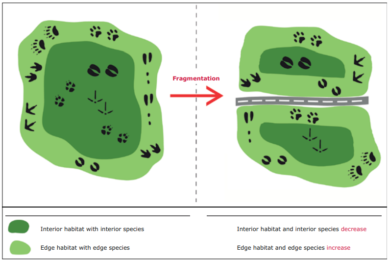{fig-align="center"}

::::

::: {.absolute bottom=-80 right=20 style="font-size: 0.4em; color: gray;"}
Source: [European Environment Agency (2011)](https://www.eea.europa.eu/en/analysis/publications/landscape-fragmentation-in-europe)
:::

::: {.notes}
Start by defining the urgency. Mention that Schaffhausen was identified by WSL as one of the 8 most fragmented cantons. Distinguish between structural connectivity (just geometry) and functional connectivity (how the animal actually moves).
:::

## Focal Species: *Capreolus capreolus*

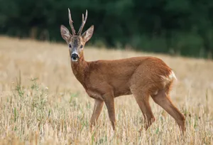{fig-align="center"}

::: {.absolute bottom=-80 right=20 style="font-size: 0.4em; color: gray;"}
Source: [Encyclopædia Britannica](https://www.britannica.com/animal/roe-deer)
:::

## Project Objectives

::: {.incremental .spaced-list}
1.  **Develop Resistance Surface**

    Create a detailed resistance surface

2.  **Model Connectivity**

    Perform a **Least-Cost Path (LCP)** analysis to compute potential wildlife corridors

3.  **Identify Conflicts**

    Analyze the resulting model to identify and map **critical bottlenecks**
:::

# 2. Methodology

## Study Area

{width="100%" fig-align="center"}

## Resistance Surface Creation

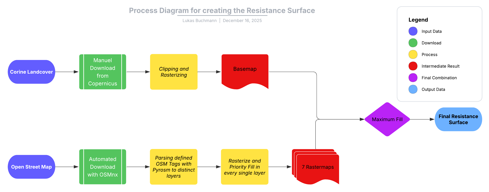{fig-align="center"}

::: {.absolute bottom=-80 right=20 style="font-size: 0.4em; color: gray;"}
Sources: [Copernicus Land Monitoring Service](https://land.copernicus.eu/); [OpenStreetMap contributors](https://www.openstreetmap.org)
:::

## Least Cost Path Analysis

* [**Step 1**: Grid Sampling (2km spacing).]{.fragment fragment-index=1}
* [**Step 2**: Node Validation (Filter for Habitat Cost = 1).]{.fragment fragment-index=2}
* [**Step 3**: Pairwise Least-Cost Path (LCP) Simulation.]{.fragment fragment-index=3}

::: {.r-stack .margin-top-0em}

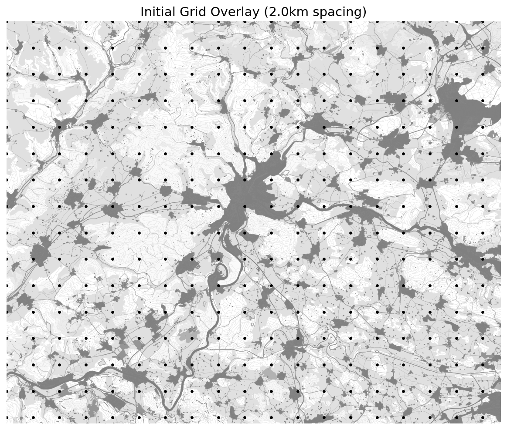{.fragment .fade-in-then-out fragment-index=1 width="45%" fig-align="center"}

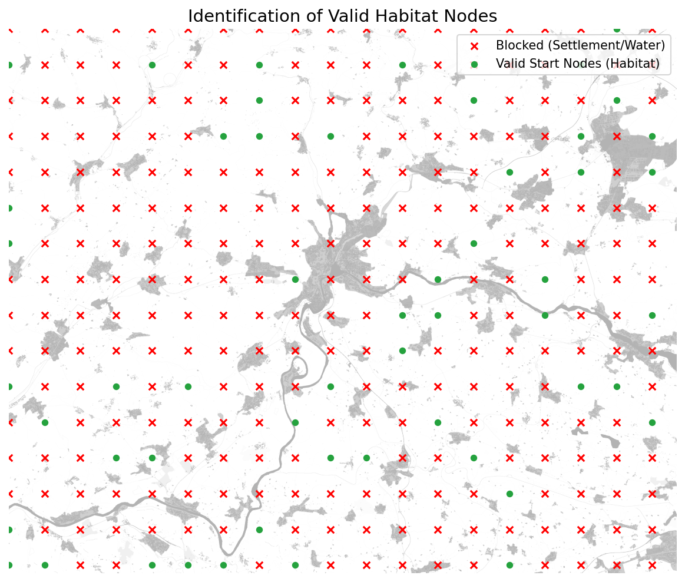{.fragment .fade-in-then-out fragment-index=2 width="45%" fig-align="center"}

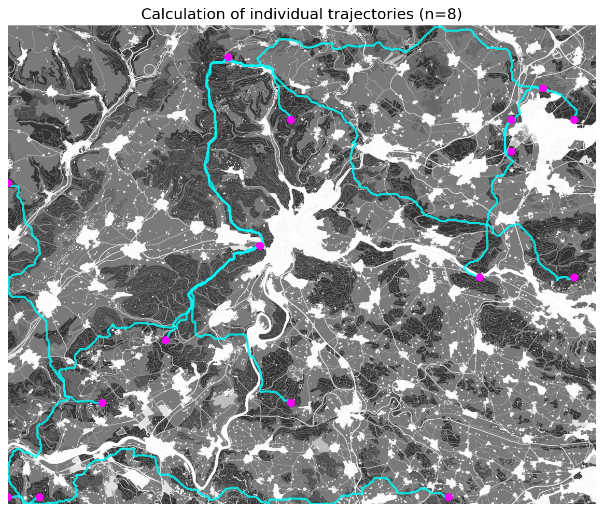{.fragment .fade-in-then-out fragment-index=3 width="45%" fig-align="center"}

::: {.fragment .fade-in fragment-index=4 style="text-align: center; margin-top: 0em;"}
### Algorithm & Function

**Library**: `scikit-image` (Python)

**Module**: `skimage.graph`

**Function**: `MCP_Geometric`

> "Calculates the least-cost distance through a raster cost surface allowing for diagonal movement."
:::

:::

# 3. Results

## Resistance Surface

:::: {.columns}

::: {.column width="70%"}
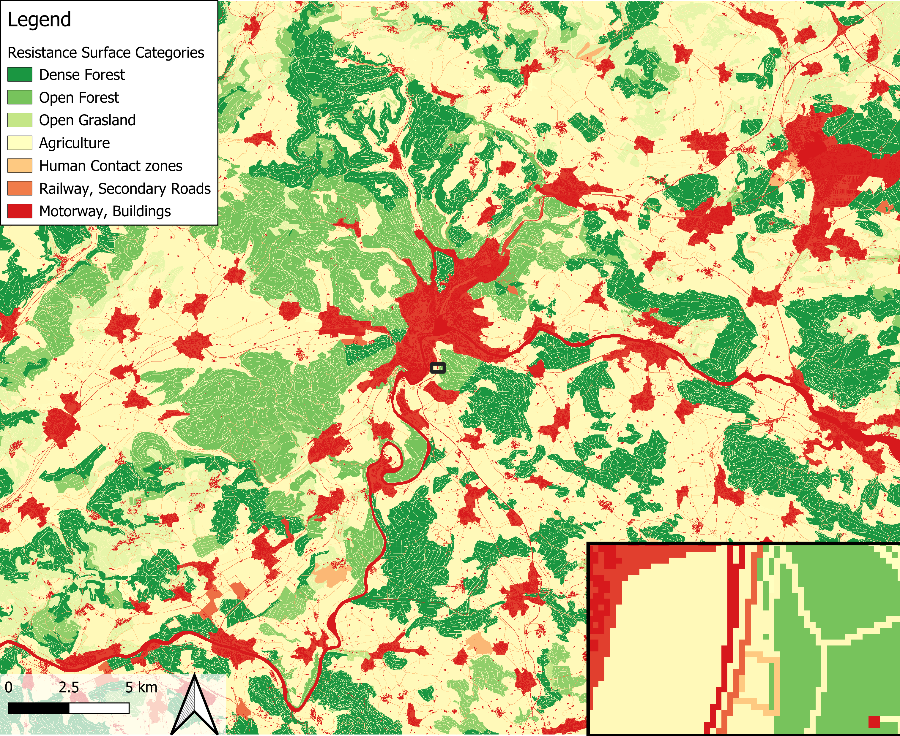{width="100%"}
:::

::: {.column width="30%"}

**Observations**:

- Fragmented

- Bifurcated

- Anthropogenic
:::

::::

## Connectivity Network

:::: {.columns}

::: {.column width="80%"}

:::

::: {.column width="20%"}
**Observations:**

- Dendritic (Tree-like)

- Narrow strips

- Fragile

- Bottlenecked
:::

::::

## Critical Bottlenecks

**Definition**: Top 5% movement intensity intersections with High Resistance (Cost ≥ 3000).

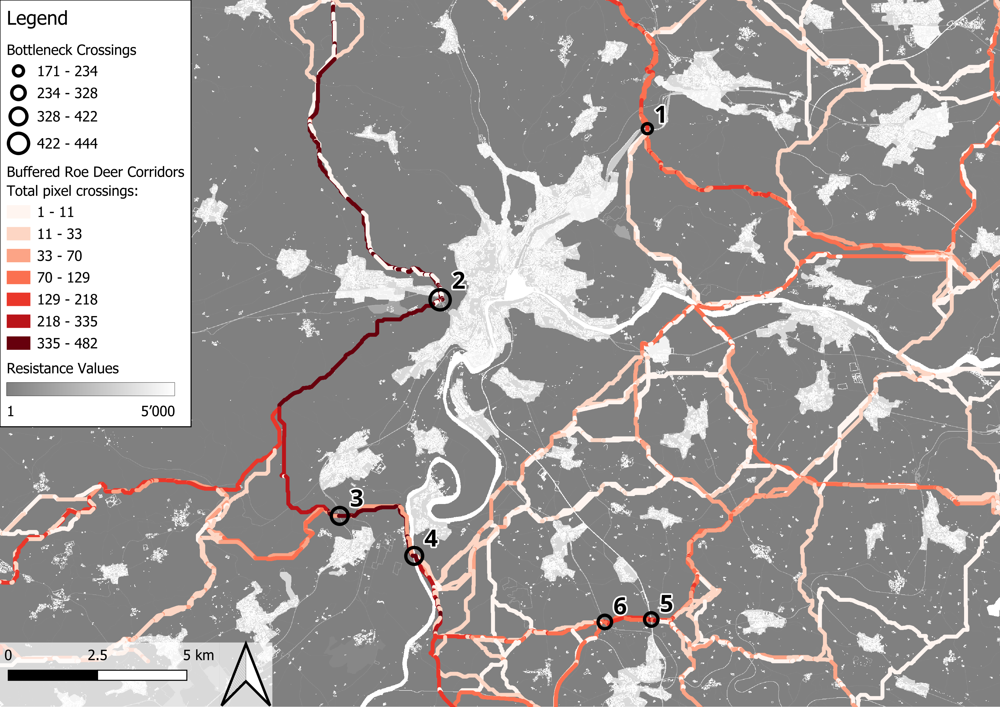{width="100%"}

# 4. Discussion

## The "Western Corridor" (Klettgau)

**Significance**: The *only* functional North-South link bypassing the city to the West.

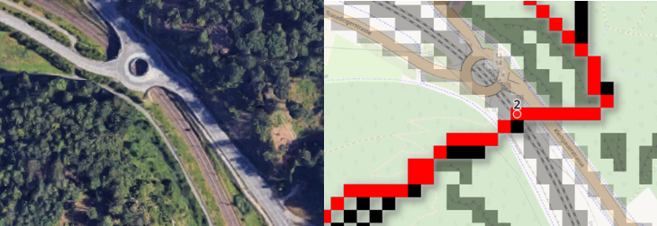{width="60%" fig-align="center"}

## Model Validation: "Ground Truthing"

**Bottleneck 5: Schneitenberg**

The model predicted an existing wildlife overpass.

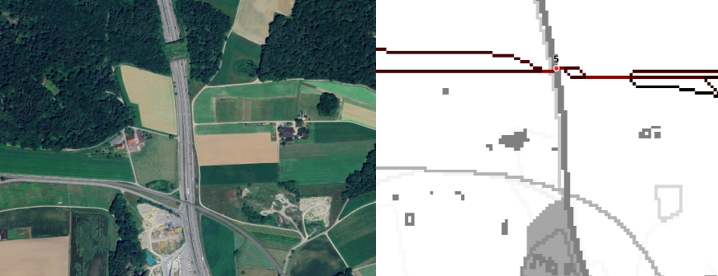

# 5. Conclusion

## Key Takeaways

::: {.incremental}
1.  **Fragile Network**: Connectivity relies on a few high-intensity bottlenecks.

2.  **The "Western Corridor"**: The Klettgau region is a critical region because of the large agricultural area.

3.  **Actionable Data**:
    * **Protect**: The Western Corridor (limit urban and agricultural sprawl).
    * **Mitigate**: Building Wildlife Overpasses.
    * **Restore**: Increase "stepping stones" (hedges) in the Klettgau agricultural area.
:::

## Limitations and Future Improvements

::: {.incremental}
* **Methodological Improvements**:
    * Integrate Digital Elevation Model (DEM) to account for slope.
    * Dynamic Movement Modeling (Day vs. Night).
* **Reproducibility**:
    * Fix Protocolbuffer Binary Format (.pbf) inconsistencies.
    * Access CLC Data automatically.

* The Python pipeline should be fully automated and transferable to other Regions.
:::
---

## {background-image="images/Roe_deer.webp" background-size="cover" background-opacity="0.4"}

::: {.absolute top="50%" left="50%" style="transform: translate(-50%, -50%); text-align: center; color: white;"}

<h1 style="color: black; margin-bottom: 1em;">Thank you for your attention.</h1>

<h3 style="color: black;">Questions?</h3>

:::

---

## Bonus: Boundary Topology {.smaller}

### The "Floor" Convention (GDAL)

* **Logic**: `rasterio` (via GDAL) uses **floor-based indexing** relative to the origin (Top-Left).
* **The Formula**:
    $$Col = \lfloor \frac{x_{point} - x_{origin}}{pixel\_width} \rfloor$$
* **Edge Case Rule**:
    * Therefore, a coordinate falling *exactly* on the grid line is assigned to the **Right** (East) or **Bottom** (South).

::: {.absolute bottom=-80 right=20 style="font-size: 0.8em; color: gray;"}
Source: [GDAL Raster Data Model](https://gdal.org/user/raster_data_model.html)
:::

## Feedback

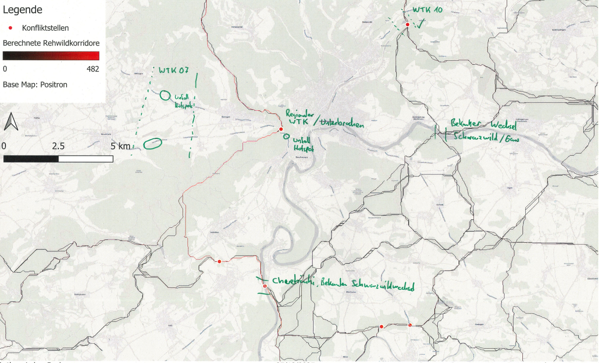{width="80%" fig-align="center"}